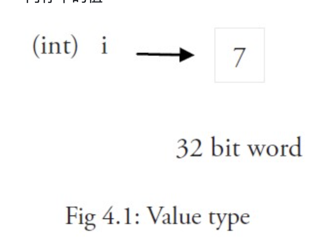
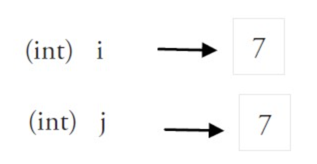

# 变量

## 简介
声明变量的一般形式是使用`var`关键字：`var identifier type`

Go 在声明变量时将变量的类型放在变量的名称之后。Go 为什么要选择这么做呢？

第一，为了避免像 C 语言中那样含糊不清的声明形式，例如：`int* a, b;`。
在这个例子中，只有`a`是指针而`b`不是。
在 Go 中，则可以很轻松地将它们都声明为指针类型：
```go
var a, b *int
```
其次，这种语法能够按照从左到右的顺序阅读，使得代码更加容易理解。
示例：
```go
var a int
var b bool
var str string
```
还可以使用因式分解：
```go
var (
    a int
    b bool
    str string
)
```

这种因式分解关键字的写法一般用于声明全局变量。

当一个变量被声明之后，系统自动赋予它该类型的零值：`int`为`0`，`float32(64)`为`0.0`，`bool`为`false`，`string`为空字符串，指针为`nil`。记住，所有的内存在 Go 中都是经过初始化的。

变量的命名规则遵循骆驼命名法，即首个单词小写，每个新单子的首字母大写，例如：`numShips`和`startDate`。

首字母需要大写，如果一个变量需要被外部引用。

函数体内的声明为局部变量。

Go 编译器拥有类型推断能力，所以很多情况下可以不用写清楚具体的类型，只有当想要给变量的类型不是自动推断出来的某种类型时，才需要显式地指定变量的类型，例如：
```go
var n int64 = 2
```

## 值类型和引用类型
在 Go 中， `int`、`float`、`bool`和`string`这些基本类型都属于值类型，使用这些类型的变量直接指向存在内存中的值：


另外，像数组和结构这些复核类型也是值类型。

当使用等号`=`将一个变量的值赋值给另一个变量时，如：`j = i`，实际上是存在内存中奖`i`的值进行了拷贝：


可以通过`&i`来获取变量`i`的内存地址。值类型的变量的值存储在栈中。


## 使用 := 赋值操作符
如果在变量初始化的时候，省略变量的类型可以由编译器自动推断，如果使用自动推断的类型，再写上 var 关键字就变得这个行为就变得多余，可以直接使用简写`a := 5`

使用变量的时候i，首选推荐`:=`的形式，它只能被用在函数体内，而不可以用于全局变量的声明与赋值。使用操作符`:=`可以高效地创建一个新的变量，称之为初始化声明。

空白标识符 `_` 被用于抛弃值

## init 函数
变量除了可以在全局声明中初始化，也可以在`init()`函数中初始化。
这是一类非常特殊的函数，它不能够为人调用，而是在每个包初始化后自动执行，并且执行优先级比`main()`函数高。
每个源文件可以包含多个`init()`函数，同一个源文件中的`init()`函数会按照从上到下的顺序执行，如果一个包有多个源文件包含`init()`函数的话，则官方鼓励但不保证以文件名的顺序调用。初始化总是以单线程并按照包的依赖关系顺序执行。